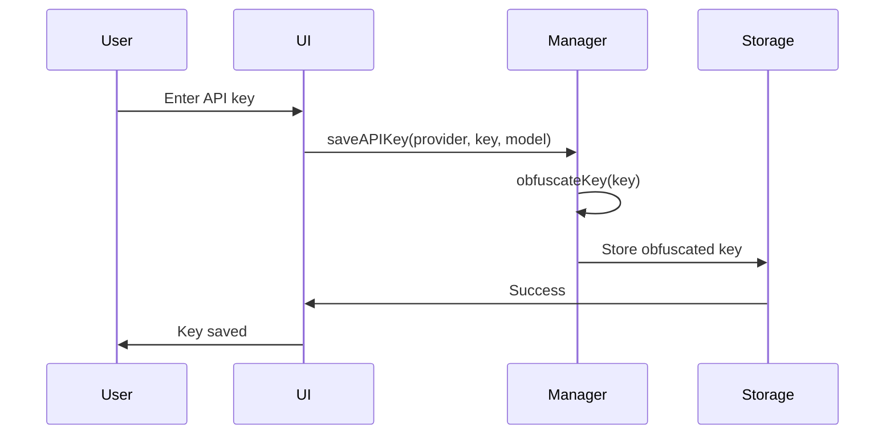
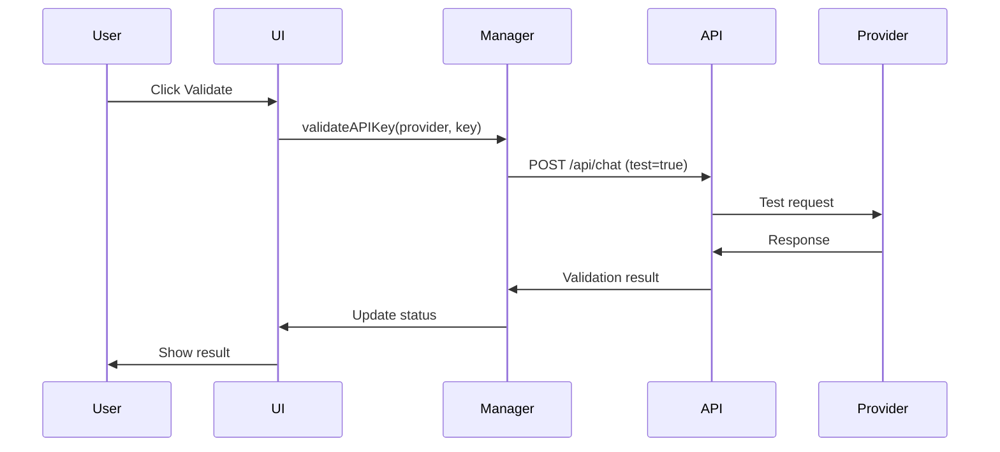
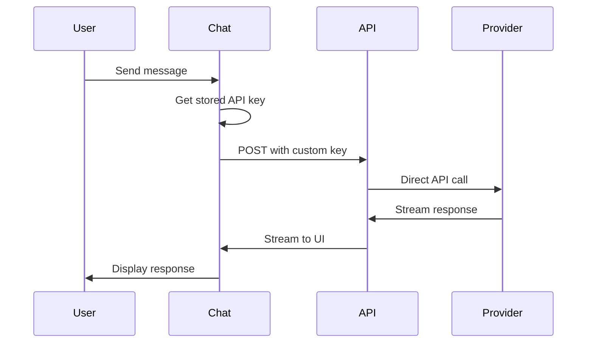

# 🔧 BYOK Developer Guide

## Architecture Overview

The BYOK (Bring Your Own Key) system is designed with security and transparency as core principles. This guide explains the technical implementation and how to extend or modify the system.

## 🏗️ System Architecture

### **Client-Side Components**

```
components/
├── api-key-manager.tsx      # Main API key management UI
├── settings-panel.tsx       # Modal wrapper for settings
└── chat-interface.tsx       # Integration with chat system

lib/
├── api-key-manager.ts       # Core key management logic
├── llm-providers.ts         # Provider configuration
└── theme-provider.tsx       # Theme system
```

### **Server-Side Components**

```
app/api/chat/
└── route.ts                 # Enhanced with key validation
```

## 🔐 Security Implementation

### **Key Storage Strategy**

```typescript
// Keys are stored in localStorage with basic obfuscation
const obfuscateKey = (key: string): string => {
  return btoa(key) // Base64 encoding (not encryption)
}

const deobfuscateKey = (obfuscatedKey: string): string => {
  return atob(obfuscatedKey)
}
```

**Security Notes:**
- Base64 encoding is **not encryption** - it's obfuscation
- Keys are still readable with browser dev tools
- This is intentional for transparency
- For production, implement proper encryption

### **API Key Validation**

```typescript
// Client-side validation with minimal API usage
const validateAPIKey = async (provider: string, apiKey: string) => {
  const response = await fetch('/api/chat', {
    method: 'POST',
    body: JSON.stringify({
      provider,
      apiKey,
      test: true,
      messages: [{ role: 'user', content: 'Hello' }]
    })
  })
  
  return response.ok
}
```

**Validation Process:**
1. Make minimal test request (1-2 tokens)
2. Verify API key works
3. Update validation status
4. Provide user feedback

## 🛠️ Core Components

### **API Key Manager (`lib/api-key-manager.ts`)**

```typescript
class SecureAPIKeyManager {
  // Key storage and retrieval
  saveAPIKey(provider: string, apiKey: string, model: string): void
  getAPIKey(provider: string): string | null
  removeAPIKey(provider: string): void
  clearAllKeys(): void
  
  // Validation
  validateAPIKey(provider: string, apiKey: string): Promise<KeyValidationResult>
  
  // Transparency
  getTransparencyInfo(): TransparencyInfo
}
```

**Key Features:**
- Client-side only storage
- Obfuscated key storage
- Real-time validation
- Transparency information
- Error handling and cleanup

### **API Key Manager UI (`components/api-key-manager.tsx`)**

```typescript
interface APIKeyManagerProps {
  onKeysUpdated: (configs: Record<string, ProviderConfig>) => void
}
```

**UI Features:**
- Provider-specific key inputs
- Real-time validation feedback
- Key visibility toggle
- Transparency panel
- Error handling and display

### **Enhanced Chat Route (`app/api/chat/route.ts`)**

```typescript
// Handle API key validation requests
if (test && apiKey) {
  return handleAPIKeyValidation(provider, apiKey, model)
}

// Use custom API keys for chat requests
const modelInstance = getModelInstance(provider, selectedModel, apiKey)
```

**Enhancements:**
- API key validation endpoint
- Custom API key support
- Fallback to environment variables
- Error handling and logging

## 🔄 Data Flow

### **Key Storage Flow**



### **Validation Flow**



### **Chat Flow with Custom Keys**



## 🧪 Testing Strategy

### **Unit Tests**

```typescript
// Test key storage and retrieval
describe('API Key Manager', () => {
  test('should save and retrieve API key', () => {
    apiKeyManager.saveAPIKey('cerebras', 'test-key', 'model')
    expect(apiKeyManager.getAPIKey('cerebras')).toBe('test-key')
  })
  
  test('should obfuscate keys in storage', () => {
    // Verify keys are base64 encoded in localStorage
  })
})
```

### **Integration Tests**

```typescript
// Test complete user workflows
describe('BYOK Integration', () => {
  test('should complete full BYOK workflow', async () => {
    // 1. Add API key
    // 2. Validate key
    // 3. Use in chat
    // 4. Verify transparency info
  })
})
```

### **API Tests**

```typescript
// Test server-side validation
describe('API Key Validation', () => {
  test('should validate API key successfully', async () => {
    const response = await POST(request)
    expect(response.status).toBe(200)
  })
})
```

## 🔧 Extension Points

### **Adding New Providers**

1. **Update Provider Configuration**

```typescript
// lib/llm-providers.ts
export const llmProviders: Record<string, LLMProvider> = {
  // ... existing providers
  newProvider: {
    id: 'newProvider',
    name: 'New Provider',
    description: 'Description',
    defaultModel: 'default-model',
    models: [
      { id: 'model1', name: 'Model 1' }
    ],
    color: 'bg-blue-500',
    icon: '🚀'
  }
}
```

2. **Add Model Instance Support**

```typescript
// lib/llm-providers.ts
export function getModelInstance(providerId: string, modelId: string, customApiKey?: string) {
  // ... existing providers
  if (providerId === 'newProvider') {
    return newProvider(modelId, {
      apiKey: customApiKey || process.env.NEW_PROVIDER_API_KEY
    })
  }
}
```

3. **Update UI Components**

```typescript
// components/api-key-manager.tsx
const providers = [
  // ... existing providers
  { id: 'newProvider', name: 'New Provider', placeholder: 'Your New Provider API key' }
]
```

### **Enhancing Security**

1. **Add Encryption**

```typescript
// lib/api-key-manager.ts
import CryptoJS from 'crypto-js'

const encryptKey = (key: string, password: string): string => {
  return CryptoJS.AES.encrypt(key, password).toString()
}

const decryptKey = (encryptedKey: string, password: string): string => {
  const bytes = CryptoJS.AES.decrypt(encryptedKey, password)
  return bytes.toString(CryptoJS.enc.Utf8)
}
```

2. **Add Key Rotation**

```typescript
// lib/api-key-manager.ts
const rotateKey = async (provider: string): Promise<boolean> => {
  // Implement key rotation logic
  // Notify user of rotation
  // Update stored key
}
```

3. **Add Usage Monitoring**

```typescript
// lib/api-key-manager.ts
interface UsageStats {
  requests: number
  tokens: number
  lastUsed: Date
  cost: number
}

const trackUsage = (provider: string, tokens: number): void => {
  // Track API usage
  // Update usage statistics
  // Alert on limits
}
```

### **Adding Features**

1. **Key Import/Export**

```typescript
// lib/api-key-manager.ts
const exportKeys = (): string => {
  const configs = getStoredConfigs()
  return JSON.stringify(configs, null, 2)
}

const importKeys = (jsonData: string): boolean => {
  try {
    const configs = JSON.parse(jsonData)
    // Validate and import
    return true
  } catch {
    return false
  }
}
```

2. **Key Sharing (Secure)**

```typescript
// lib/api-key-manager.ts
const generateShareableToken = (provider: string): string => {
  // Generate temporary, revocable token
  // Not the actual API key
  return generateSecureToken()
}
```

3. **Usage Analytics**

```typescript
// lib/api-key-manager.ts
const getUsageAnalytics = (): UsageAnalytics => {
  return {
    totalRequests: 0,
    totalTokens: 0,
    averageLatency: 0,
    costBreakdown: {},
    providerComparison: {}
  }
}
```

## 🚀 Deployment Considerations

### **Environment Variables**

```bash
# .env.local
CEREBRAS_API_KEY=your_cerebras_key
OPENAI_API_KEY=your_openai_key
ANTHROPIC_API_KEY=your_anthropic_key
```

### **Production Security**

1. **Implement Proper Encryption**
2. **Add Rate Limiting**
3. **Add Usage Monitoring**
4. **Implement Key Rotation**
5. **Add Audit Logging**

### **Monitoring**

```typescript
// Add monitoring for:
// - API key validation failures
// - Unusual usage patterns
// - Security events
// - Performance metrics
```

## 🔍 Debugging

### **Common Issues**

1. **Keys Not Saving**
   - Check localStorage availability
   - Verify browser permissions
   - Check for storage quota limits

2. **Validation Failures**
   - Verify API key format
   - Check provider API status
   - Verify network connectivity

3. **Chat Failures**
   - Check API key is loaded
   - Verify provider configuration
   - Check model availability

4. **Test Configuration Issues**
   - Jest `moduleNameMapping` property name needs to be `moduleNameMapping`
   - React component tests need proper JSX syntax support
   - Date object serialization in tests may need string conversion

### **Debug Tools**

```typescript
// Add to browser console for debugging
window.debugAPIKeys = {
  getKeys: () => apiKeyManager.getStoredConfigs(),
  clearKeys: () => apiKeyManager.clearAllKeys(),
  validateKey: (provider, key) => apiKeyManager.validateAPIKey(provider, key),
  getTransparency: () => apiKeyManager.getTransparencyInfo()
}
```

## 📚 Best Practices

### **Security**
- Never log API keys
- Use HTTPS in production
- Implement proper encryption
- Add rate limiting
- Monitor for abuse

### **User Experience**
- Provide clear error messages
- Show validation status
- Offer transparency information
- Make key management easy
- Provide helpful documentation

### **Performance**
- Cache validation results
- Minimize API calls
- Use efficient storage
- Optimize UI rendering
- Monitor performance metrics

---

This developer guide provides the foundation for understanding, extending, and maintaining the BYOK system. For questions or contributions, refer to the project documentation or create an issue.
